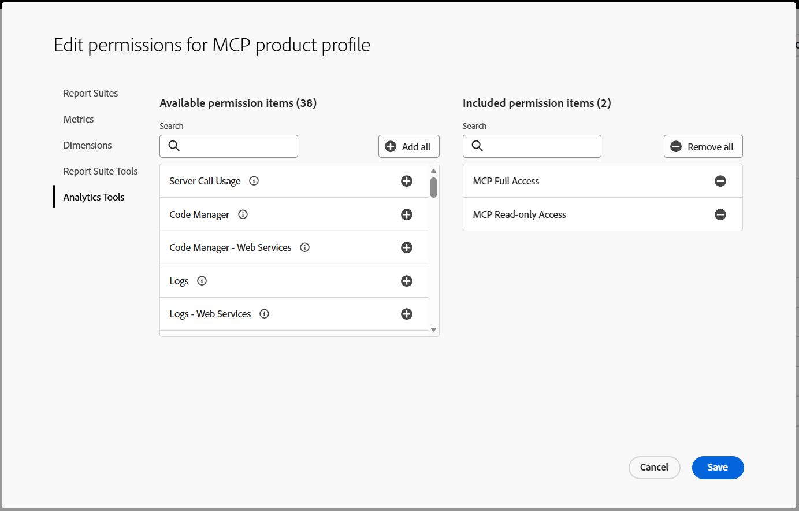
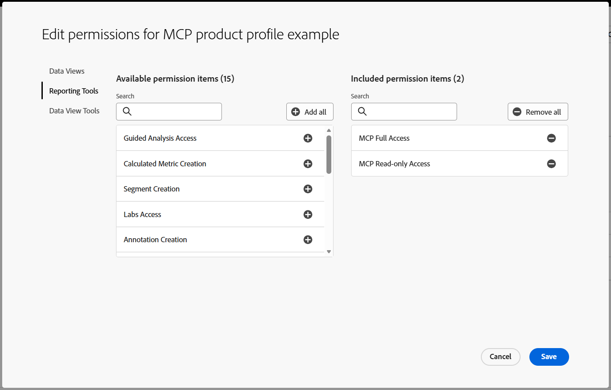
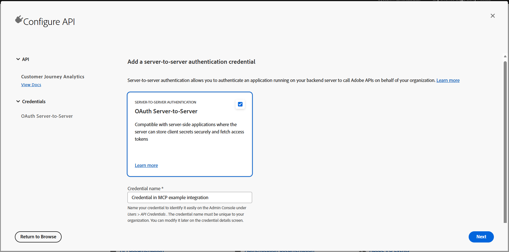

# Set up permissions

Access to the Adobe Analytics and Customer Journey Analytics MCP servers is controlled by permission items in [Adobe Admin Console](https://adminconsole.adobe.com) product profiles. Every user needs one of the two MCP permission items before they can use an MCP server. *This requirement applies to all users, including product administrators and system administrators.*

## Permission items

| Permission item | What it allows |
|---|---|
| **MCP Read-only Access** | Connect to the MCP server, find and describe components, run reports, and set session defaults. |
| **MCP Full Access** | Everything that MCP Read-only Access allows, plus creating and updating segments, calculated metrics, date ranges, workspace projects, and audiences. |

Permissions combine across product profiles, so a user who belongs to any product profile that includes **MCP Full Access** has full access.

The MCP servers also enforce each user's existing Adobe Analytics and Customer Journey Analytics permissions. For example, a user with **MCP Full Access** can create segments only if their product profile also allows segment creation.

See the [Adobe Analytics tool reference](../aa/reference.md) and the [Customer Journey Analytics tool reference](../cja/reference.md) for the permission that each tool requires.

## Request access

If you don't have an MCP permission item, request one from your organization's administrators. If you're not sure whether you have one, [verify your access](#verify-access) first.

1. Determine which permission item you need: **MCP Read-only Access** to query data, or **MCP Full Access** to also create or update components.
1. Contact a system administrator or product administrator within your organization. This contact is typically the individual or team that granted you access to Adobe Analytics or Customer Journey Analytics.
1. Include the following details in your request:
   * The product: Adobe Analytics, Customer Journey Analytics, or both
   * Your organization name and, for Adobe Analytics, each login company that you use
   * The permission item that you need
1. After your administrator grants access, [verify your access](#verify-access).

## Grant access

If you're a system administrator or product administrator, expand the section for your product. You can add an MCP permission item to an existing product profile, which grants it to every user in that profile, or create a dedicated product profile to grant it only to specific users.

<AccordionItem slots="heading, text, image"/>

### Adobe Analytics

1. Sign in to [Adobe Admin Console](https://adminconsole.adobe.com). If you belong to more than one organization, select the correct organization from the menu.
1. Select **Products** at the top of the page.
1. Select **Adobe Analytics**.
1. Select the product profile that you want to update, or select **New Profile** to create one. Each Adobe Analytics product profile applies to a single login company, so repeat these steps for each company where users need access.
1. On the **Users** tab, confirm that each user who needs access is listed. To add users, select **Add user**, enter the name, email address, or user group of each user, then select **Save**.
1. Select the **Permissions** tab.
1. Select the pencil edit icon next to **Analytics Tools**.
1. In the list of available permission items, select the add icon (**+**) next to **MCP Read-only Access** or **MCP Full Access**.
1. Select **Save**.
1. Ask each user to [verify their access](#verify-access).

<AccordionItem slots="heading, text, image"/>

### Customer Journey Analytics

1. Sign in to [Adobe Admin Console](https://adminconsole.adobe.com). If you belong to more than one organization, select the correct organization from the menu.
1. Select **Products** at the top of the page.
1. Select **Customer Journey Analytics**.
1. Select the product profile that you want to update, or select **New Profile** to create one.
1. On the **Users** tab, confirm that each user who needs access is listed. To add users, select **Add user**, enter the name, email address, or user group of each user, then select **Save**.
1. Select the **Permissions** tab.
1. Select the pencil edit icon next to **Reporting Tools**.
1. In the list of available permission items, select the add icon (**+**) next to **MCP Read-only Access** or **MCP Full Access**.
1. Select **Save**.
1. Ask each user to [verify their access](#verify-access).

<AccordionItem slots="heading, text, text, image"/>

### OAuth server-to-server credentials

Technical accounts used for [OAuth server-to-server connections](oauth.md) also need an MCP permission item.

1. Add **MCP Read-only Access** or **MCP Full Access** to a product profile, following the steps for your product above. Use **MCP Full Access** if the integration creates or updates components. You can skip adding users.
1. In [Adobe Developer Console](https://developer.adobe.com/console/), open the project that contains your OAuth server-to-server credential.
1. Add the Adobe Analytics or Customer Journey Analytics API to the project, or edit the existing one, and select the product profile from step 1.
1. Save your changes.
1. To confirm, open the product profile in Admin Console and select the **API credentials** tab. The technical account should be listed.

## Verify access

1. Connect your LLM client to the MCP server. If you haven't set one up yet, see [Choose your client](index.md#choose-your-client). If your client was already connected when access changed, disconnect the MCP connector and reconnect it.
1. Ask a question that requires access to your data:
   * **Adobe Analytics**: "What report suites do I have access to?"
   * **Customer Journey Analytics**: "What data views do I have access to?"
1. If the client returns an authorization or permission error, wait and reconnect the MCP connector, because permission changes might not take effect immediately. If the error persists, see [Troubleshooting](../support/troubleshooting.md#authentication-and-permissions).
